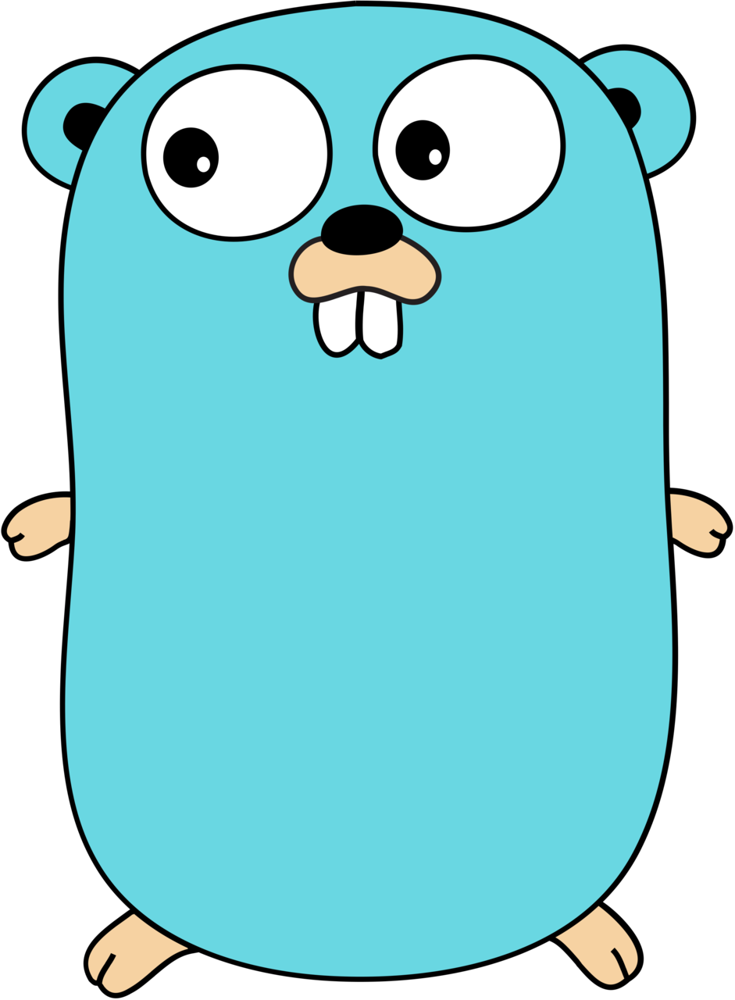

# 欢迎 To My profile

I am **Mr. Binary Sniper**, I can write code on these languages..

<svg width="100%" height="auto" viewBox="0 0 4621 876" fill="none" xmlns="http://www.w3.org/2000/svg">
<rect width="1265" height="876" fill="#D9D9D9"/>
<rect x="1678" width="1265" height="876" fill="#D9D9D9"/>
<rect x="3356" width="1265" height="876" fill="#D9D9D9"/>
</svg>
